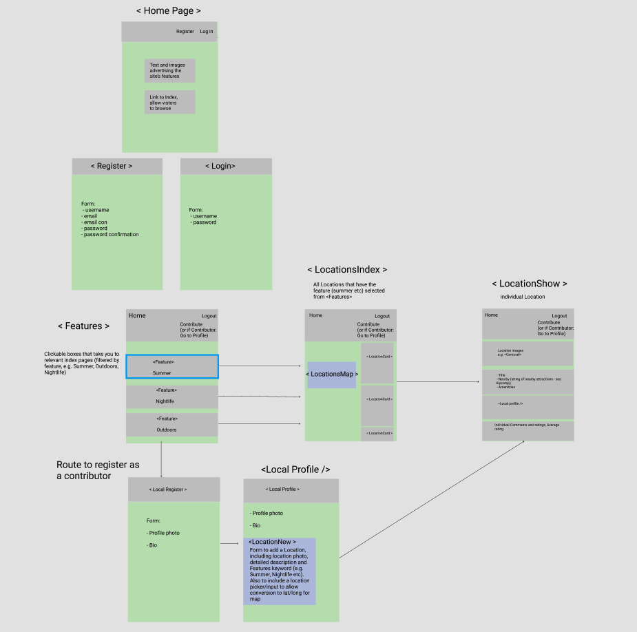

# sei-project-3
A repository for SEI Group Project MERN

# The Montréal Project - GA Project Three

The Montréal Project is a MERN stack app designed for local people to share their experiences and favorite destinations in and around Montréal. Users can either browse from a wide range of activites and can add their own attractions once signed up, allowing them to also comment and rate other users postings. The aim was to build a fun and interactive site for Montréal dwellers. 

### Goal and timeframe 

- This was a four person group project, we had 8 days to create a fully functioning application.

### Technologies Used
- React.js
- Node.js
- Express
- MongoDB/Mongoose
- Semantic UI React
- Axios
- React Mapbox GL
- Nodemon
- HTTP-proxy-middleware
- Bcrypt
- jsonwebtoken
- Git, and GitHub

### Process

- We utilised wireframes on Figma to guide the MVP and Trello for managing progress. As a team of four, we split the tasks, sometimes working individually and sometimes pair       coding. 
- Working on a group project creating a wireframe was really important to make sure we were all working to the same goal.
- We had a stand up every morning and looked at our trello board creating a list of the days tasks and reviewing the previous days achievements. This structure meant that we kept to the time schedule and also celebrate the small wins of the previous day. 
- We also checked in throughout the day if were done with a certain task and were moving onto the next - this meant that we would have fewer Github conflicts. 

### Figma Wireframe

### Trello tracker 

- Communication was key in building this app to we spent a lot of time building the wireframe and logic flow of the site. 
- We started off with all four of us getting the basics up and running; backend and frontend basic funtionality and then we broke off into pairs to work on different aspects of   the site. 
- I worked on the frontend building out the landing page, login and register components. 

### Challenges 
- Working with Github and managing the cinflicts that occured due to multiple people working on one project. 
- Error handling 
- Working across multiple components 
- Using a styling framework

### Reflection & Key Learning 

- This was great project to work on in terms of working with a larger team. Working together gave me an insight into how other people work through coding problems. 
- Effective communication and progress tracking through trello
- Data modelling in MongoDB and the difference between embedded and referenced data.
- How to utilise API endpoints to render the required data on the front-end.

 
